

# final-project-skeleton

**Team Number: 30**

**Team Name: int main(void)**

| Team Member Name | Email Address          |
| ---------------- | ---------------------- |
| Zexin Feng       | zexinf@seas.upenn.edu  |
| Peiyu Chen       | peiyuch@seas.upenn.edu |
| Yuxin Jing       | jingyxg@seas.upenn.edu |

**GitHub Repository URL: https://github.com/upenn-embedded/final-project-f25-f25-final_project-t30.git**

**GitHub Pages Website URL:** [for final submission]*

## Final Project Proposal

### 1. Abstract

*In a few sentences, describe your final project.*

Our final project is to design an intelligent device that enables crops in arid regions to receive varying levels of drip irrigation under different environmental conditions, in order to alleviate the water shortage and economic pressure in the area.

### 2. Motivation

*What is the problem that you are trying to solve? Why is this project interesting? What is the intended purpose?*

In order to address the issue of water shortage for crops in arid environments such as deserts, we are inspired to come up with the idea of designing drip irrigation for plant roots.
We believe this will alleviate the water shortage problem in arid areas and bring positive impacts to the economy.
Our ultimate goal is to add intelligent devices to the root systems of plants, which can determine whether drip irrigation is needed based on changes in environmental temperature and humidity.

### 3. System Block Diagram

*Show your high level design, as done in WS1 and WS2. What are the critical components in your system? How do they communicate (I2C?, interrupts, ADC, etc.)? What power regulation do you need?*

[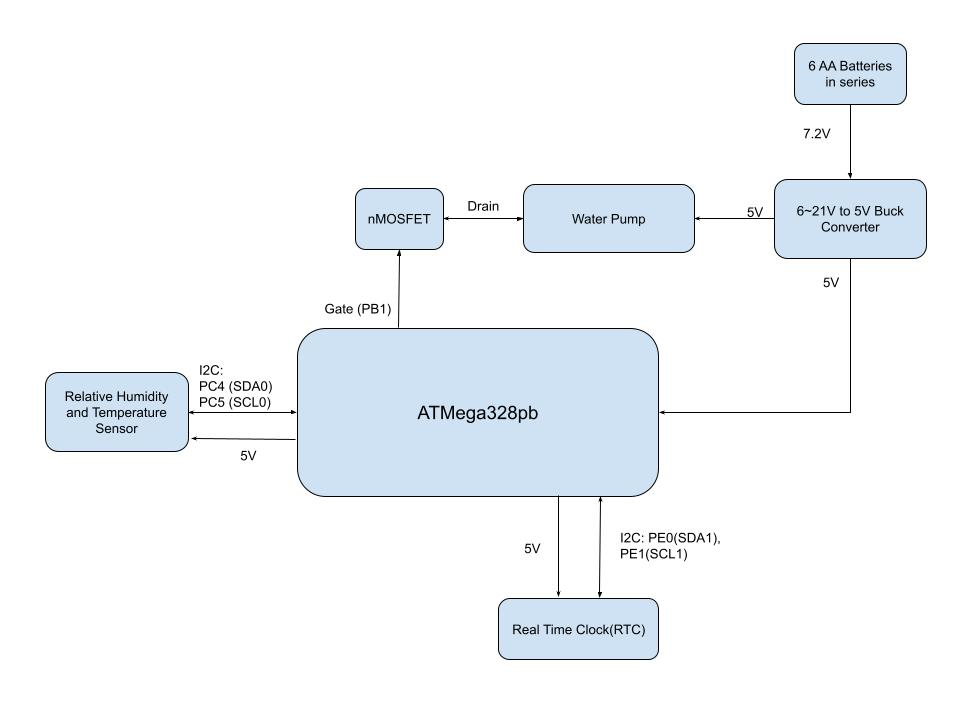](https://github.com/upenn-embedded/final-project-f25-f25-final_project-t30/blob/main/images/block_diagram.jpg)

### 4. Design Sketches

*What will your project look like? Do you have any critical design features? Will you need any special manufacturing techniques to achieve your vision, like power tools, laser cutting, or 3D printing?  Submit drawings for this section.*

Our project will be placed in a rectangular container. Since the water pump we picked does not touch the liquid, there are rubber hoses on both sides that can be used for water extraction and drip irrigation, making it convenient for management. Regarding the production of the rectangular containers, we might need 3D printing or laser cutting.

[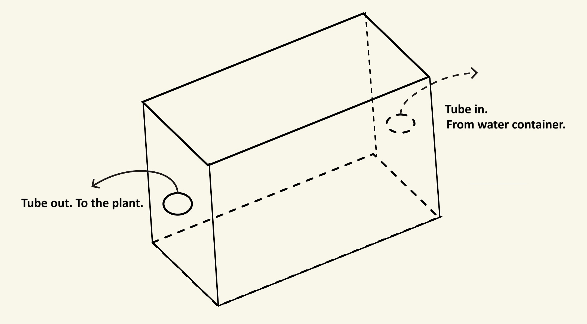](https://github.com/upenn-embedded/final-project-f25-f25-final_project-t30/blob/main/images/design_sketch.jpg)

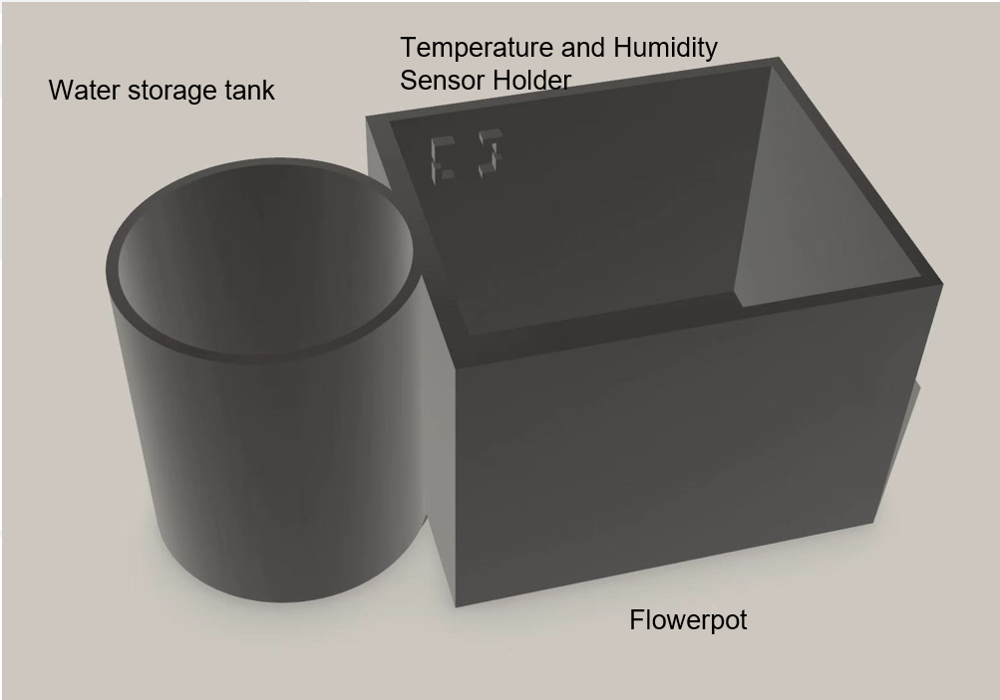

### 5. Software Requirements Specification (SRS)

*Formulate key software requirements here. Think deeply on the design: What must your device do? How will you measure this during validation testing? Create 4 to 8 critical system requirements.*

*These must be testable! See the Final Project Manual Appendix for details. Refer to the table below; replace these examples with your own.*

**5.1 Definitions, Abbreviations**

Here, you will define any special terms, acronyms, or abbreviations you plan to use for hardware

**5.2 Functionality**

| ID     | Description                                                                                                                                                                                                         |
| ------ | ------------------------------------------------------------------------------------------------------------------------------------------------------------------------------------------------------------------- |
| SRS-01 | In timer detection mode, automatic watering commences within a ten-second margin of error from the preset time.                                                                                                     |
| SRS-02 | Detect relative humidity every one hour. Each detection lasts 10 seconds, and takes 10 measurements. If the average value of the 10 measurements is below a certain threshold, the water pump spray water.          |
| SRS-03 | Detect temperature every one hour. Each detection lasts 10 seconds, and takes 10 measurements. If the average value of the 10 measurements is above a certain threshold, the water pump spray water.                |
| SRS-04 | The duration of each watering cycle is configurable, lasting between 5 and 15 seconds with an error margin of no more than 3 seconds. The system shall automatically shut off the pump upon completion of watering. |

### 6. Hardware Requirements Specification (HRS)

*Formulate key hardware requirements here. Think deeply on the design: What must your device do? How will you measure this during validation testing? Create 4 to 8 critical system requirements.*

*These must be testable! See the Final Project Manual Appendix for details. Refer to the table below; replace these examples with your own.*

**6.1 Definitions, Abbreviations**

Here, you will define any special terms, acronyms, or abbreviations you plan to use for hardware

**6.2 Functionality**

| ID     | Description                                                                                                                                                                                                    |
| ------ | -------------------------------------------------------------------------------------------------------------------------------------------------------------------------------------------------------------- |
| HRS-01 | The maximum operating power of the pump reaches 2.5W.                                                                                                                                                          |
| HRS-02 | A relative humidity and temperature sensor shall be used for detection of relative humidity at least ranging from 30% to 80%, and temperature at least ranging from -10 Celsius degrees to 50 Celsius degrees. |
| HRS-03 | A relative humidity and temperature sensor shall have the accuracy tolerance of 4% RH and 1 Celsius degree.                                                                                                    |
| HRS-04 | The pump's discharge volume ranges from 10ml to 40ml.                                                                                                                                                          |

### 7. Bill of Materials (BOM)

*What major components do you need and why? Try to be as specific as possible. Your Hardware & Software Requirements Specifications should inform your component choices.*

*In addition to this written response, copy the Final Project BOM Google Sheet and fill it out with your critical components (think: processors, sensors, actuators). Include the link to your BOM in this section.*

RTC: Given that plants require watering at fixed times each day, the RTC component is employed to obtain the actual time.
humidity and temperature sensor: We need a relative humidity and temperature sensor to measure the relative humidity and temperature.
nMOSFET: We need a nMOSFET such that the microcontroller generates a PWM signal to drive the water pump.
water pump: We need a water pump to pump and spray water.
battery: We choose 6 AA batteries in series to power the entire system. In this selection, we can guarantee that the system will operate for a longer period of time and that the water pump will function properly.
buck converter: we choose a 6-21V to 5V buck converter to power our MCU and water pump. The converter can make sure that even if the battery voltage drops over time, this DC-DC converter can still operate within the safe range.

[Bill of Materials](https://docs.google.com/spreadsheets/d/1MR1oCDyVYyIMvUjpufy-YVIjdKPqdEgM09sydmImXsU/edit?usp=sharing)

### 8. Final Demo Goals

*How will you demonstrate your device on demo day? Will it be strapped to a person, mounted on a bicycle, require outdoor space? Think of any physical, temporal, and other constraints that could affect your planning.*

On demo day, we need to install the nozzles of the drip irrigation system at the roots of the plants, and control the drip water time according to changes in the environment. Once the pump is turned on, water can be drawn from the water tank at the other end to supply water to the plants.

### 9. Sprint Planning

*You've got limited time to get this project done! How will you plan your sprint milestones? How will you distribute the work within your team? Review the schedule in the final project manual for exact dates.*

| Milestone  | Functionality Achieved                                                                                              | Distribution of Work                                                                                                                             |
| ---------- | ------------------------------------------------------------------------------------------------------------------- | ------------------------------------------------------------------------------------------------------------------------------------------------ |
| Sprint #1  | Build a project prototype; Test the temperature and humidity sensor, RTC; Try to control the water pump through PWM | Zexin will work on build prototype and control water pump; Yuxin will work on test RTC; Peiyu will work on test  temperature and humidity sensor |
| Sprint #2  | Work on controlling the water pump by the changes of temperature and humidity.                                      | We will work on this part together.                                                                                                              |
| MVP Demo   | Work on controlling the water pump by the time set up.                                                              | We will work on this part together.                                                                                                              |
| Final Demo | Work on how to put everything together.                                                                             | We will work on this part together.                                                                                                              |

**This is the end of the Project Proposal section. The remaining sections will be filled out based on the milestone schedule.**

## Sprint Review #1

### Last week's progress

Finished the test of RTC module:

1. Complete the circuit assembly for the RTC.
2. Establish I²C communication between the RTC and MCU.
3. Read the BCD-formatted data from the RTC and convert it into readable time data.
4. Implement RTC output data for year, month, day, weekday and time.
5. code of RTC test: [RTC_test.c](./code/RTC_test.c)

Completed UART commnunication between 2 boards, LCD screen display and Blynk web dashboard display:

1. Show pseudo temperature and relative humidity on the LCD screen.[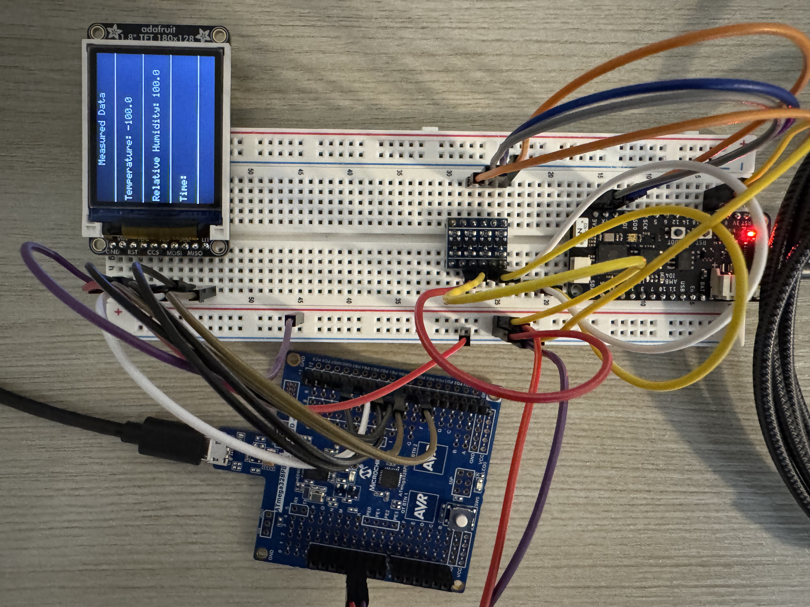](https://github.com/upenn-embedded/final-project-f25-f25-final_project-t30/blob/main/images/sprint1_screen.jpg)
2. Enable communication between ATmega328PB and ESP32 through UART.[uart.c](https://github.com/upenn-embedded/final-project-f25-f25-final_project-t30/blob/main/code/uart.c) and [screen_uart_main.c](https://github.com/upenn-embedded/final-project-f25-f25-final_project-t30/blob/main/code/screen_uart_main.c).[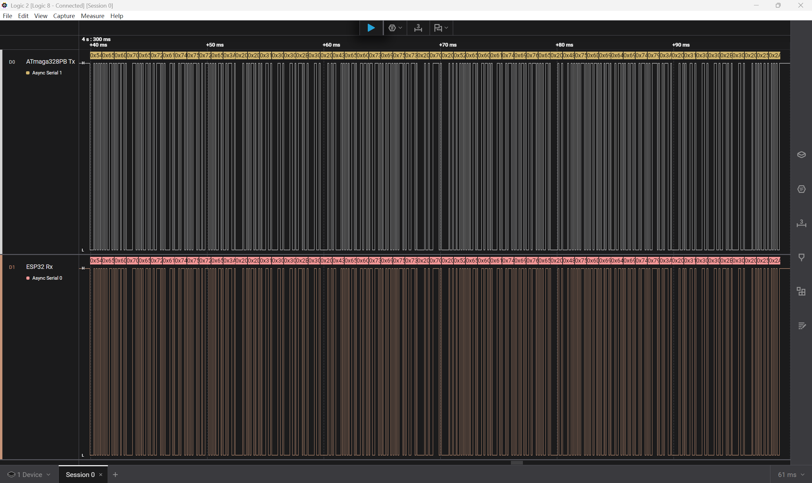](https://github.com/upenn-embedded/final-project-f25-f25-final_project-t30/blob/main/images/sprint1_TxRx.png)
   [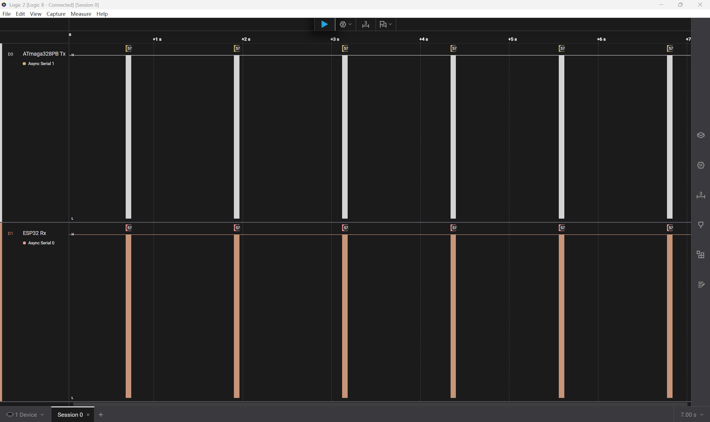](https://github.com/upenn-embedded/final-project-f25-f25-final_project-t30/blob/main/images/sprint1_TxRxmultiple.png)
   Notes: 1. The ESP32 UART uses 8 data bits and **1 stop bit** as default. 2. Need a Blynk timer to prevent disconnecting. 3. Blynk.virtualWrite does NOT run in the main loop. 4. Convert float data into char arraries and then combine them into one char array is easier for data transmission from ATmega328PB to ESP32. 5. During debugging, 2 char arraies carry the same data value in string format happened because the 2 char* pointers point to the same address. Solved by NOT using one function for float-to-string conversion. 6. Use a logic level shifter for UART, since ESP32 is 3.3V and ATmega328PB is 5V.
3. Show pseudo temperature and relative humidity on Blynk web dashboard.
   [showBlynk.ino](https://github.com/upenn-embedded/final-project-f25-f25-final_project-t30/blob/main/code/showBlynk.ino) Notes: 1. Only need <BlynkSimpleEsp32.h> for ESP32 to bring WIFI to the project.
   [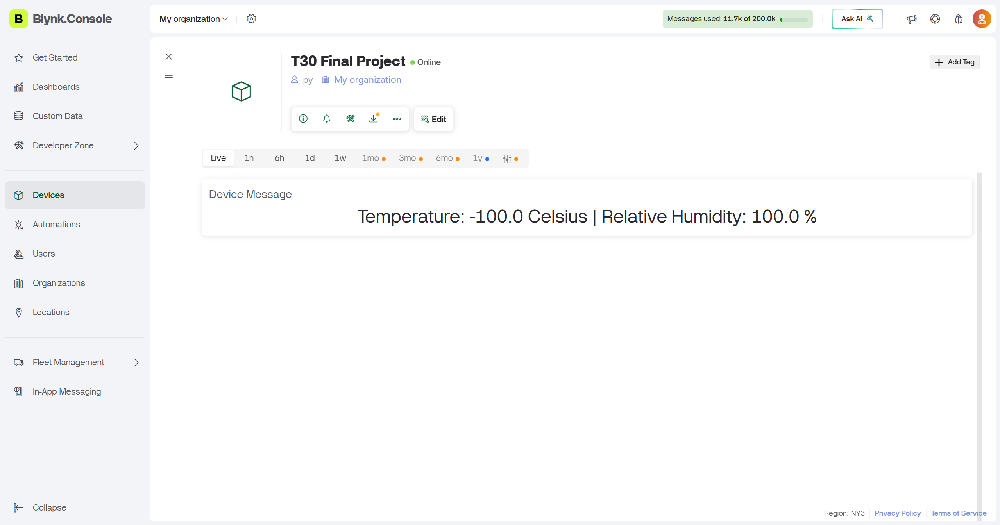](https://github.com/upenn-embedded/final-project-f25-f25-final_project-t30/blob/main/images/sprint1_blynk.png)

### Current state of project

The Real-Time Clock is functioning correctly and outputs the accurate time.
Waitnig for other components (such as: water pump, sensor and battery holder)
Trying to add low voltage (6V) detection for power source (6-7.2V battery pack)

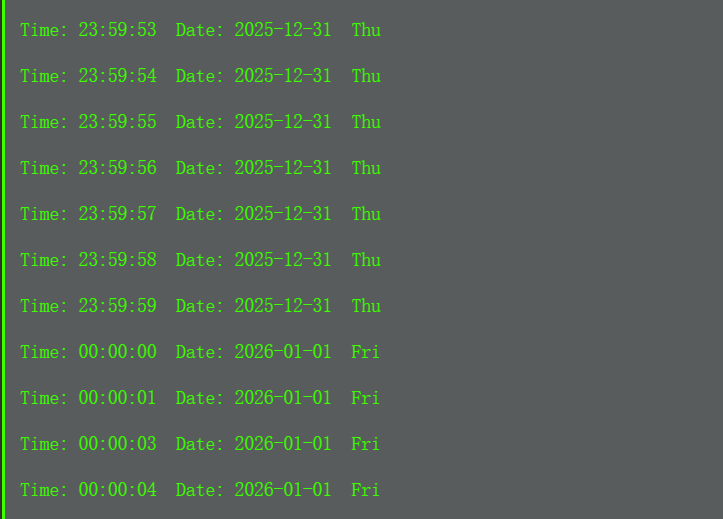

1. Realized data transmission from ATmega328PB to ESP32.
2. Brought WIFI to the project using ESP32.
3. Enabled data displaying locally and remotely.

### Next week's plan

1. Write I2C driver for the SHT30 sensor (if it arrives next week) such that it gives correct measurement that can be read by ATmega328PB. Assigned to Peiyu Chen.
2. start building prototype and write the code of the motor (water pump) drived by MCU (if it arrives next week)
   Assigned to Zexin Feng.

## Sprint Review #2

### Last week's progress

1. Wrote [SHT40 driver](https://github.com/upenn-embedded/final-project-f25-f25-final_project-t30/blob/main/code/sht40.c) using I2C0 on the ATmega328PB Xplained Mini board, which is also called TWI0 (Two-Wire Serial Interface), such that I could initialize I2C0, generate START condition and STOP condition, transmit command bytes and data bytes to SHT40 based on status code in Master Transmitter mode, and receive data bytes from SHT40 based on status code based on Master Receiver mode.
2. Changed Adafruit SHT30 temperature and relative humidity sensor to Adafruit SHT40 temperature and relative humidity sensor.Reasons:
   1. I could get SHT40 module before the arrival of SHT30 module.
   2. SHT40 module is cheaper than SHT30 module [SHT40 Webpage](https://www.adafruit.com/product/4885) and [SHT30 Webpage](https://www.adafruit.com/product/5064).
   3. SHT40 has better precision than SHT30 according to their datasheets [SHT40 Datasheet](https://sensirion.com/media/documents/33FD6951/67EB9032/HT_DS_Datasheet_SHT4x_5.pdf) and [SHT30 Datasheet](https://sensirion.com/media/documents/EA647515/63A5A524/Datasheet_SHT3x_ARP.pdf).
   4. Although SHT40 module does NOT have a waterproof shell like SHT30 module does, our project has a outer shell for all components and the sensor is NOT intended to be plugged into the soil.
   5. SHT40 has a heater such that it is able to remove water on the sensor surface and work for long time in high humidity condition. SHT30 does NOT have this function.
3. Realized measurement of temperature and relative humidity using Adafruit SHT30 temperature and relative humidity sensor and the I2C driver mentioned previously. The code takes 10 times of measurement each time for a more stable result which is used to trun ON or OFF the water pump.Test results in my apartment:**Screen and other components**
   [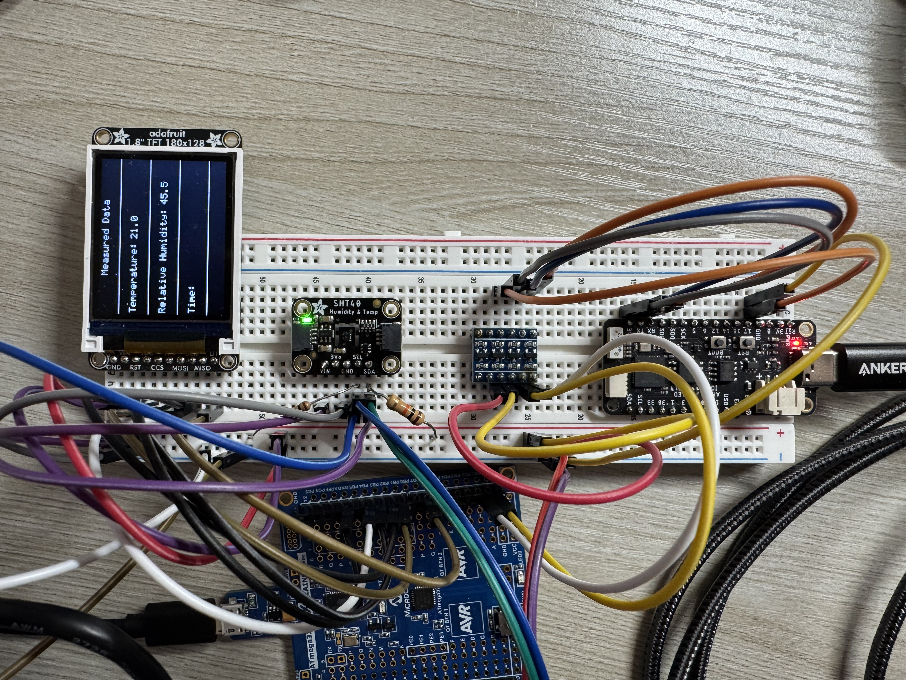](https://github.com/upenn-embedded/final-project-f25-f25-final_project-t30/blob/main/images/sprint2_screen.jpg)
   **Blynk Dashboard**
   [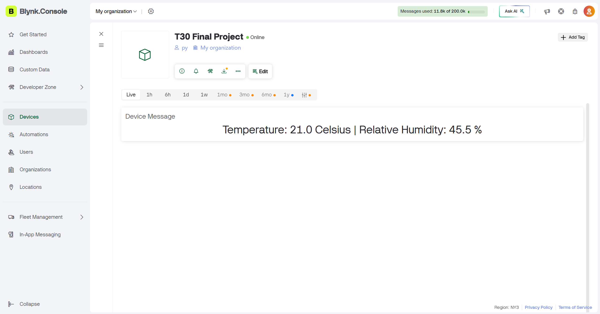](https://github.com/upenn-embedded/final-project-f25-f25-final_project-t30/blob/main/images/sprint2_blynk.png)
   **Measurement Overall**Each block represent 10 times of measurement.[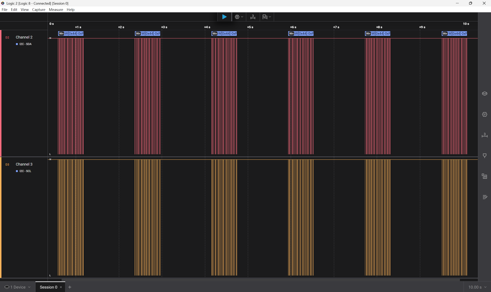](https://github.com/upenn-embedded/final-project-f25-f25-final_project-t30/blob/main/images/sprint2_i2c0_overall.png)
   **10 Measurements in 1 block**1 block has 10 times of measurements.
   **One Measurement Step by Step***i.* to *iv.*: write to SHT40 to measure temperature and relative humidity; *v.* to *xiii.*: read temperature and relative humidity from SHT40. Suppose temperature/relative humidity data has the float form XX.YY Celsius / %RH.
   1. START
      [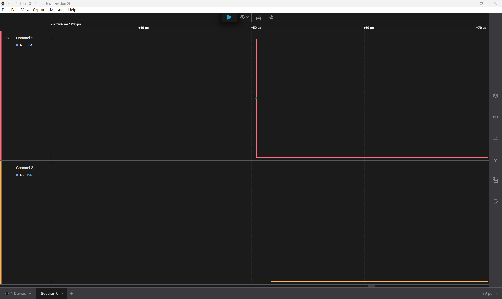](https://github.com/upenn-embedded/final-project-f25-f25-final_project-t30/blob/main/images/sprint2_1measure_1.png)
   2. SHT40 Address + WRITE
      [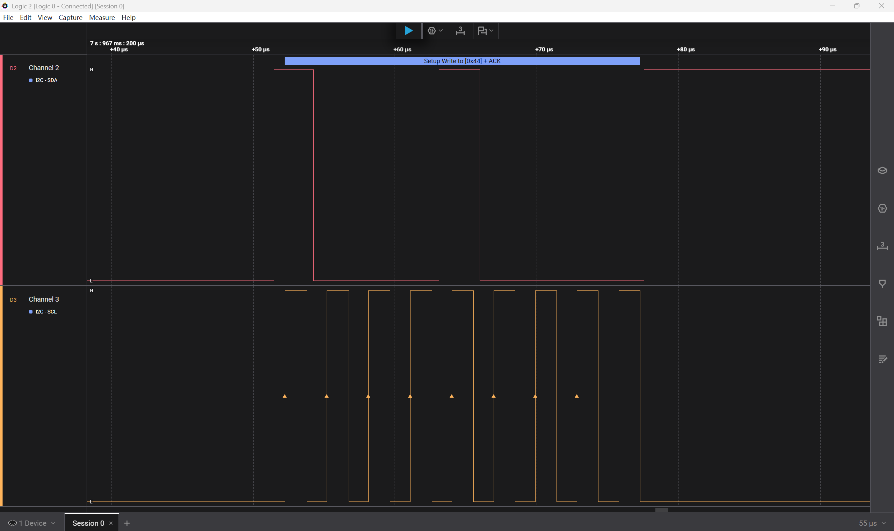](https://github.com/upenn-embedded/final-project-f25-f25-final_project-t30/blob/main/images/sprint2_1measure_2.png)
   3. Command the SHT40 to measure with high precision + ACK from SHT40
      [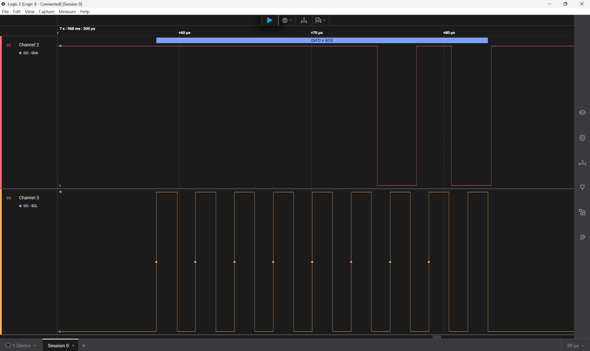](https://github.com/upenn-embedded/final-project-f25-f25-final_project-t30/blob/main/images/sprint2_1measure_3.png)
   4. STOP
      [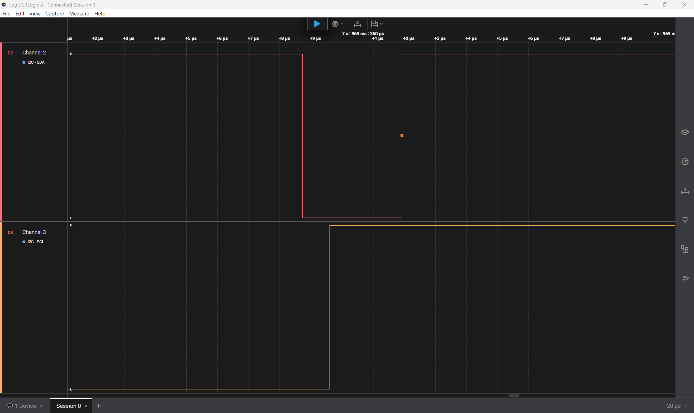](https://github.com/upenn-embedded/final-project-f25-f25-final_project-t30/blob/main/images/sprint2_1measure_4.png)
   5. START
      [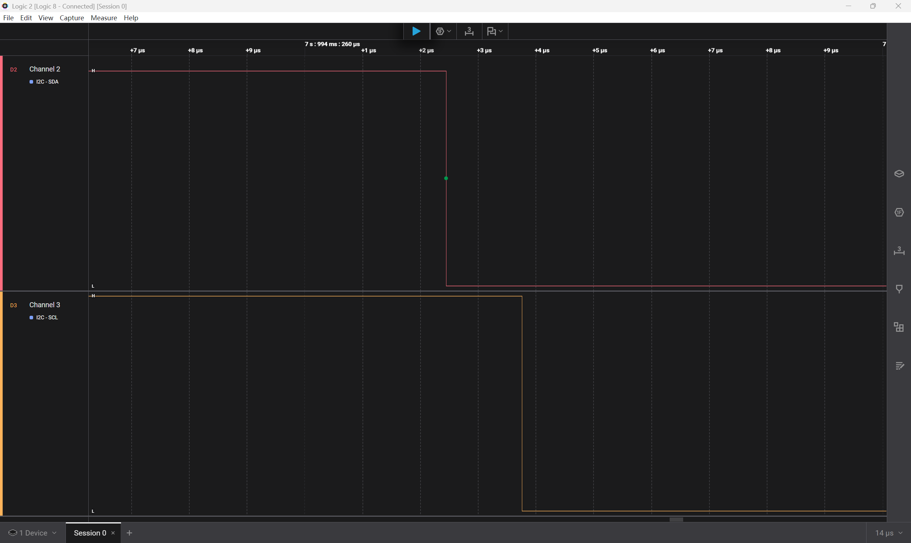](https://github.com/upenn-embedded/final-project-f25-f25-final_project-t30/blob/main/images/sprint2_1measure_5.png)
   6. SHT40 Address + READ
      [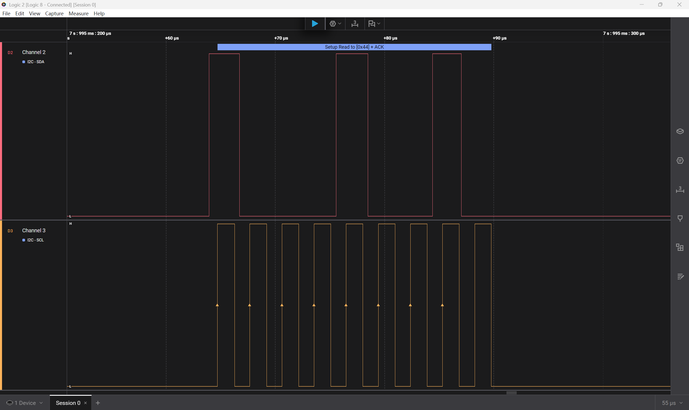](https://github.com/upenn-embedded/final-project-f25-f25-final_project-t30/blob/main/images/sprint2_1measure_6.png)
   7. Receive *YY* part of *XX.YY* for temperature + ACK from ATmega328PB
      [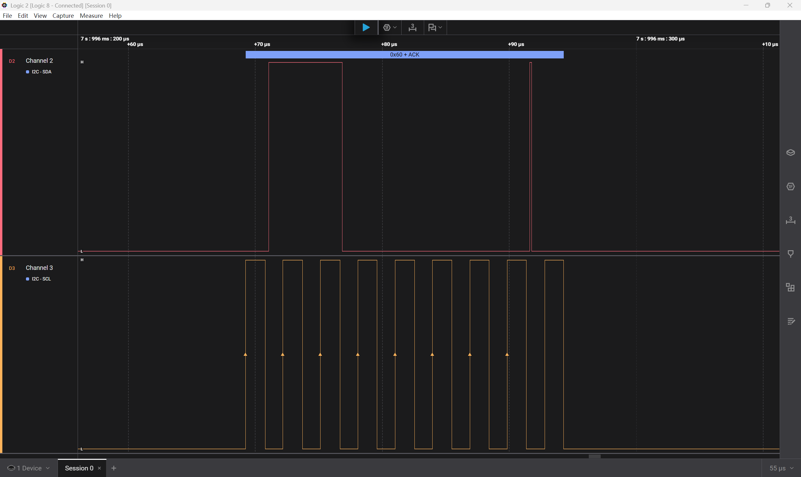](https://github.com/upenn-embedded/final-project-f25-f25-final_project-t30/blob/main/images/sprint2_1measure_7.png)
   8. Receive *XX* part of *XX.YY* for temperature + ACK from ATmega328PB
      [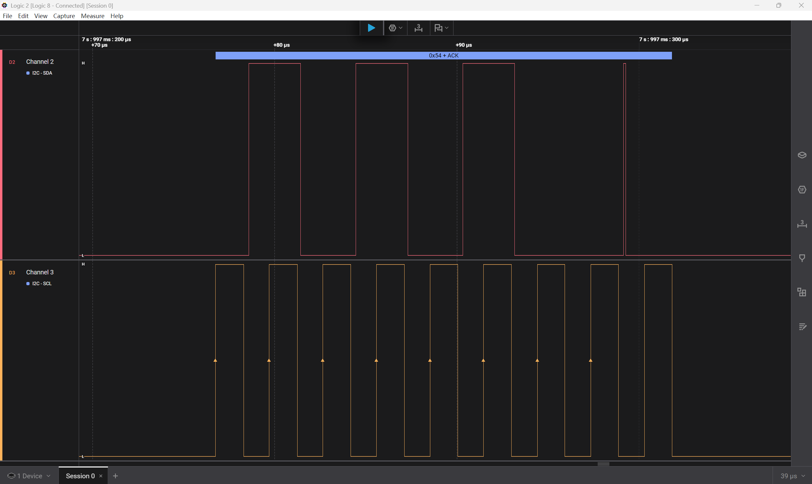](https://github.com/upenn-embedded/final-project-f25-f25-final_project-t30/blob/main/images/sprint2_1measure_8.png)
   9. Receive CRC8 byte for temperature + ACK from ATmega328PB
      [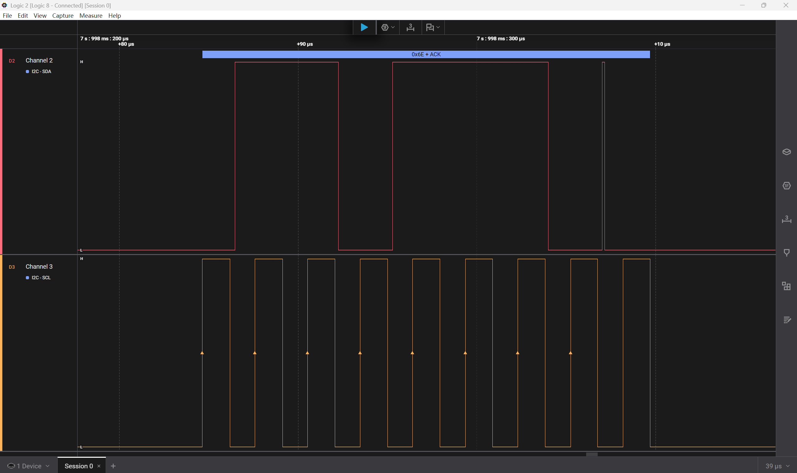](https://github.com/upenn-embedded/final-project-f25-f25-final_project-t30/blob/main/images/sprint2_1measure_9.png)
   10. Receive *YY* part of *XX.YY* for relative humidity + ACK from ATmega328PB
       [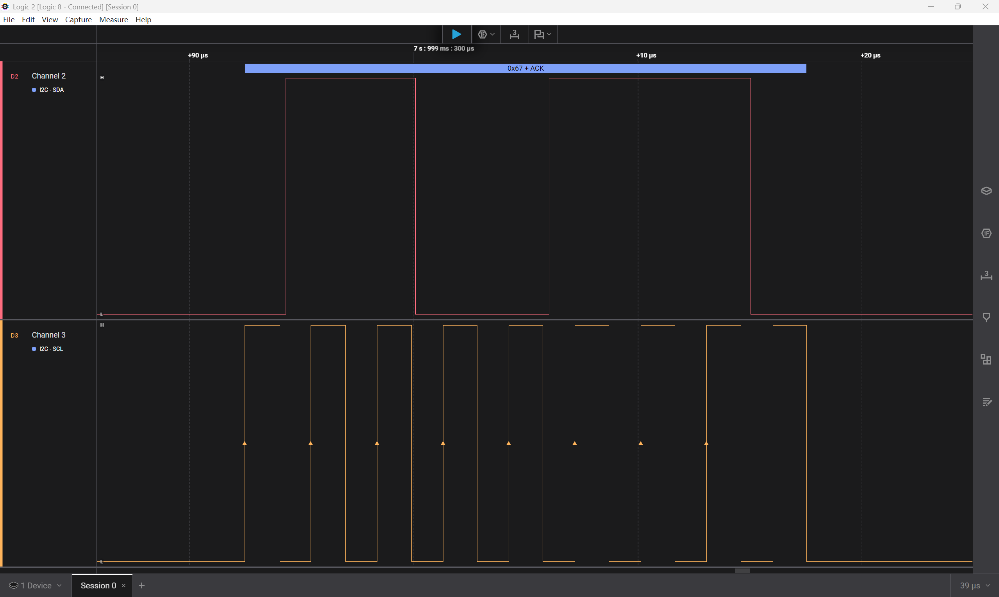](https://github.com/upenn-embedded/final-project-f25-f25-final_project-t30/blob/main/images/sprint2_1measure_10.png)
   11. Receive *XX* part of *XX.YY* for relative humidity + ACK from ATmega328PB
       [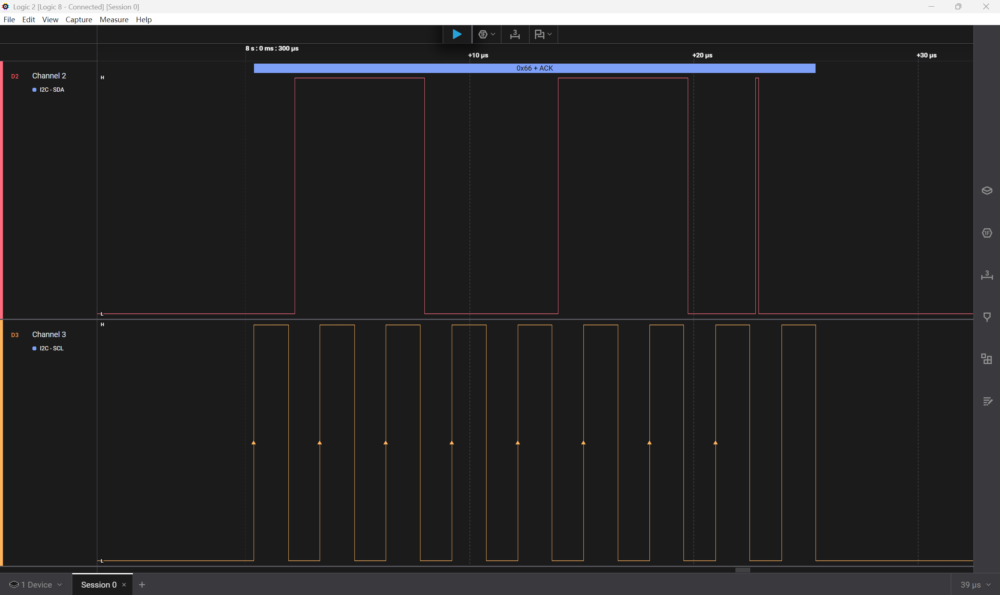](https://github.com/upenn-embedded/final-project-f25-f25-final_project-t30/blob/main/images/sprint2_1measure_11.png)
   12. Receive CRC8 byte for relative humidity + NACK from ATmega328PB (received enough data bytes, end of data reading.)
       [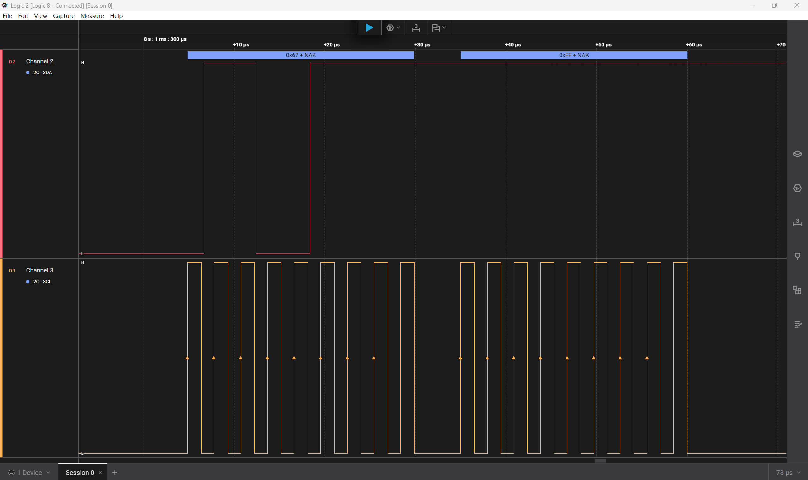](https://github.com/upenn-embedded/final-project-f25-f25-final_project-t30/blob/main/images/sprint2_1measure_12.png)
   13. SHT40 CRC8 byte initialization (Table 7 in datasheet) + NACK from ATmega328PB
       [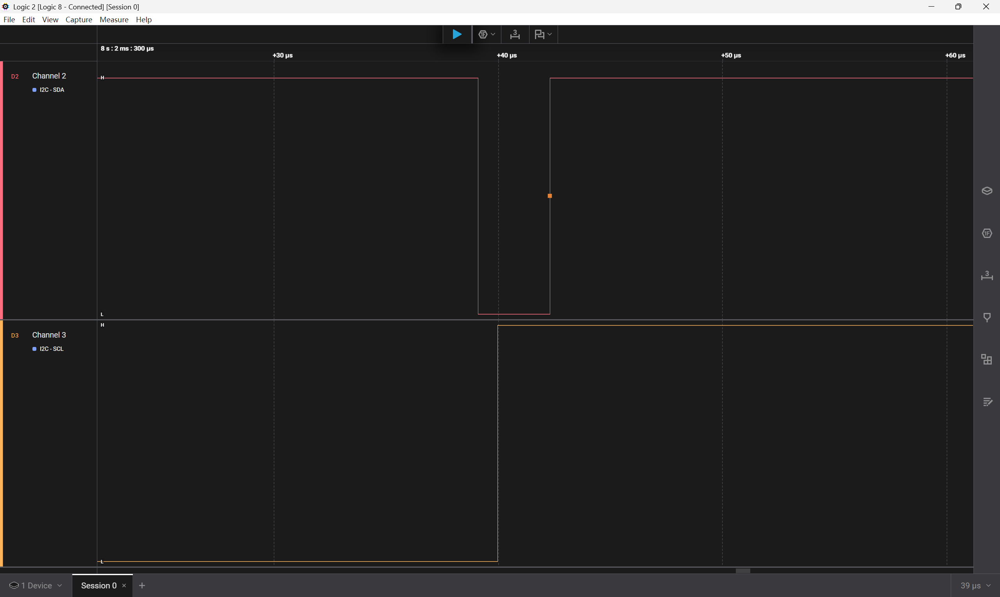](https://github.com/upenn-embedded/final-project-f25-f25-final_project-t30/blob/main/images/sprint2_1measure_13.png)
4. Notes on I2C and SHT40:
   1. SHT40 does NOT support clock stretching.
   2. Measured data will be deleted after one time of reading.
   3. All command and data transfer begins with START and ends with STOP.
   4. Temperature and Relative Humidity Data: 2 data bytes + 1 CRC8 byte for checking
   5. Temperature first, then, Relative Humidity.
   6. Unlike Figure 14 in [SHT40 Datasheet](https://sensirion.com/media/documents/33FD6951/6555C40E/Sensirion_Datasheet_SHT4x.pdf), temperature and relative humidity cannot be read in 2 START-STOP tranmission. They are read in one START-STOP transmission.
   7. I2C speed: Adafruit SHT40 Sensor has 10k Ohms pull-up resistors for SDA and SCL
      However, thery are too big for 400kHz speed, and the actual speed about 341kHz for the 400kHz configuration. Added additional 10k Ohms pull-up resistors in parallel for SDA and SCL. Now, SDA and SCL has about 5k Ohms pull-up resistance. The actual I2C speed is improved to 389kHz for the 400kHz configuration.
   8. TWSTA needs to be cleared by code; TWSTO is cleared automatically.
   9. Temperature/Relative Humidity: XX.YY - Receive the YY part first, then the XX part.
5. The 2 boards in the project has different power requirement: ESP32 FeatherS2 needs 3.3V source while ATmega328PB Xplained Mini requires 5V source. Thus, I use ELEGOO Power MB V2 board for the 2 MCU boards. From its [ELEGOO Power MB V2 Datasheet](https://static.rapidonline.com/pdf/73-4538_v1.pdf), I use a 9V battery as power source and connect it to the ELEGOO board through a Barrel connector. It is able to output 5V and 3.3V at the same time. Using a digital multimeter, its output test result are shown below.**5V Output**
   [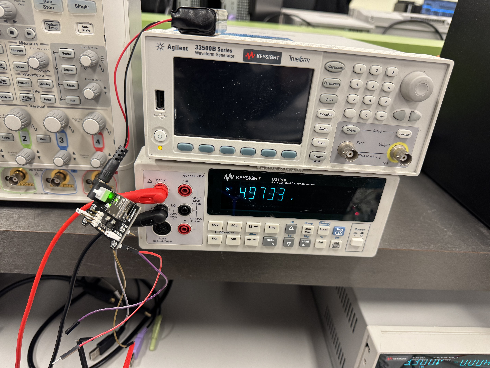](https://github.com/upenn-embedded/final-project-f25-f25-final_project-t30/blob/main/images/sprint2_newpower5V.jpg)
   **3.3V output**
   [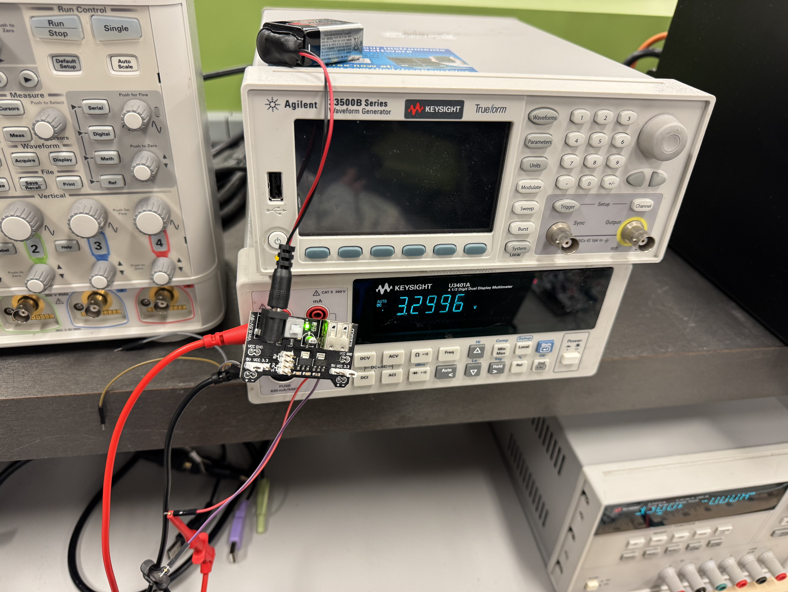](https://github.com/upenn-embedded/final-project-f25-f25-final_project-t30/blob/main/images/sprint2_newpower33V.jpg)
   **9V battery as power supply**The 9V battery I use is Energizer MAX 9V alkaline battery. From [ENERGIZER 522 datasheet](https://data.energizer.com/pdfs/522.pdf), it is able to supply enough current for the 2 boards and other components. After testing, the 9V battery powers ATmega328PB Xplained Mini, ESP32 FeatherS2 and other components through ELEGOO Power MB V2 succesfully.Test results:
   1. ATmega328PB Xplained Mini, LCD screen and SHT40 sensor work well!
      [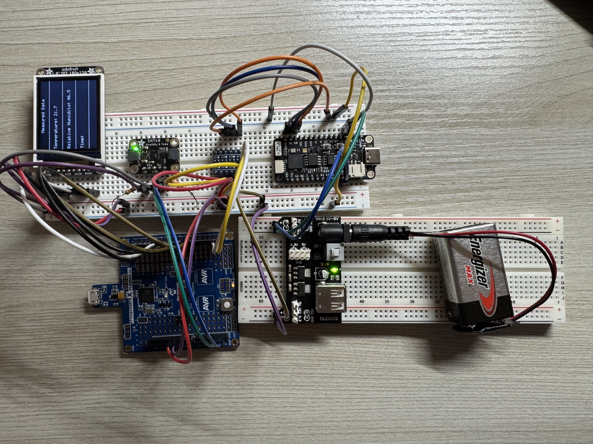](https://github.com/upenn-embedded/final-project-f25-f25-final_project-t30/blob/main/images/sprint2_battery.jpg)
   2. ESP32 FeatherS2 works well!
      [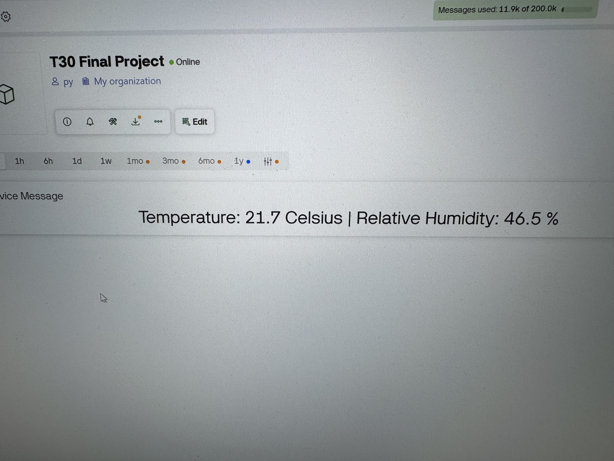](https://github.com/upenn-embedded/final-project-f25-f25-final_project-t30/blob/main/images/sprint2_batteryBlynk.jpg)

Hardware part (done): water pump test

1. During the test process, we use 12V DC water pump and 4.8V DC power to achieve our final purpose since we are still waiting for our own water pump.
   
2. We are using MOFSFET as switch to control our water pump on or off.
   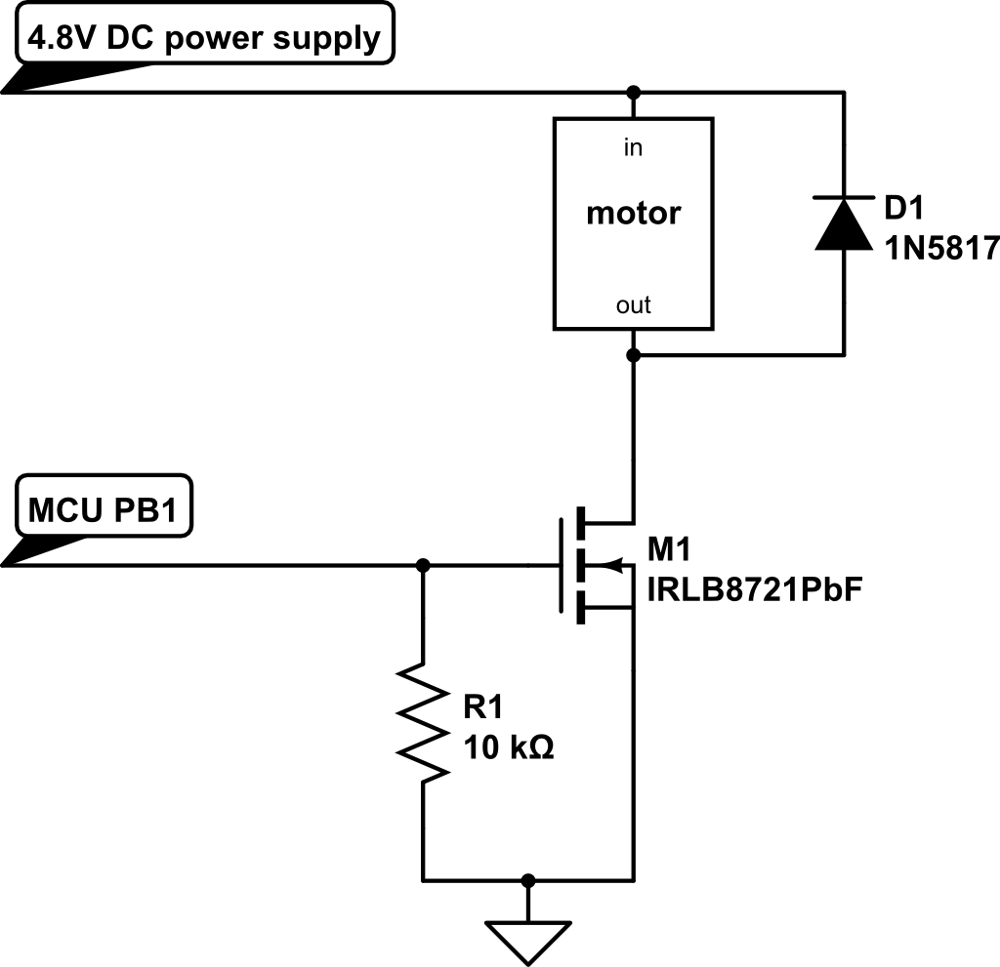
3. Build the prototype as showed above and test interrupt of pump. Write test code [test_pump](https://github.com/upenn-embedded/final-project-f25-f25-final_project-t30/blob/main/code/test_pump.c)
   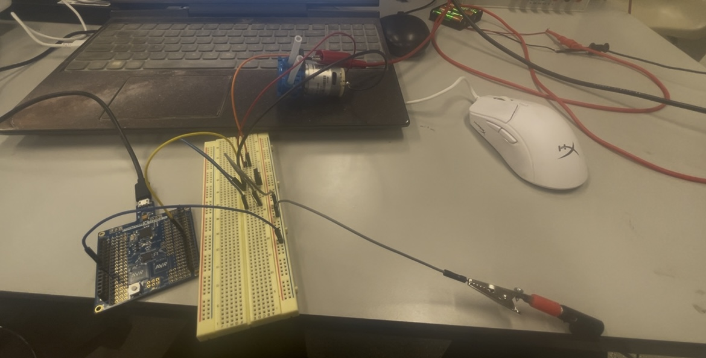

### Current state of project

1. Able to measure temperature and relative humidity.
2. Able to show temperature and relative humidity on a LCD screen through SPI (using libraries in LAB4).
3. Able to show temperature and relative humidity in Blynk dashboard using ESP32 Feather S2 and WIFI.
4. Build the prototype of the water pump.
5. Able to power the water pump and can be control by interrupt.

### Next week's plan

1. Integrate what we have done. Prepare for the MVP demo. Assigned to all team members.

## MVP Demo

1. Show a system block diagram & explain the hardware implementation.[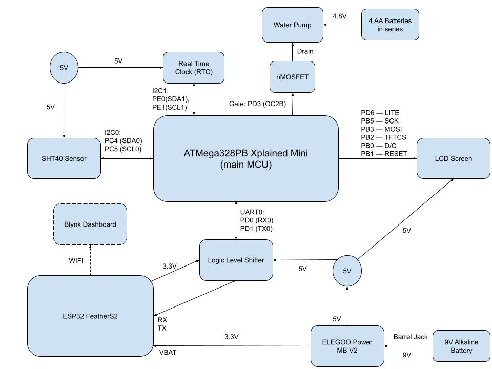](https://github.com/upenn-embedded/final-project-f25-f25-final_project-t30/blob/main/images/block_diagram_MVP.jpg)
   **1. Atmega328PB Xplained Mini (main MCU):** (1) Run code to control all peripherals. (2) Send, receive, and process data and signal. (3) Use UART0 because the microUSB on the Atmega328PB Xplained Mini also uses UART0 that I can monitor the data transmission between the Atmega328PB Xplained Mini and the ESP32 FeatherS2.**2. SHT40 Sensor:** (1) Read command from the main MCU that defines measurement mode. (2) Measure temperature and relative humidity. (3) Send measured data to the main MCU.**3. Logic Level Shifter:** (1) Convert 5V logic level used by the main MCU to 3.3V logic level used by the ESP32 FeatherS2 such that the main MCU can send measured data to the ESP32 FeatherS2.**4. ESP32 FeatherS2:** (1) Receive measured data from the main MCU. (2) Post the measured data to the Blynk Dashboard such that the user can access temperature and relative humidity remotely.**5. ELEGOO Power MB V2:** (1) Power the Atmega328PB Xplained Mini, the ESP32 FeatherS2, and other peripherals by converting the 9V voltage from the battery to outputs of 5V and 3.3V voltages.**6. MOSFET:** (1) Work as a switch to enable the main MCU to control the water pump by PWM signal.**7. Water Pump:** (1) Deliver water from a container to the plant roots.**8. LCD Screen:** (1) Show temperature, relative humidity, and time locally.
   **9. RTC:** The RTC module connects to the MCU via I²C communication. The internal alarm interrupt of the RTC is triggered through the SQW pin, thereby not occupying the MCU's CPU. The RTC module triggers the MCU to output a PWM signal from the PD2 pin via the alarm, thereby activating the water pump.
2. Explain your firmware implementation, including application logic and critical drivers you've written.**Main Logic:** UART0 initializarion, I2C initialization, SHT40 sensor softreset, and LCD screen initialization and clear. ---> Main Loop{At specific moments of time, softreset SHT40 sensor and then measure temperature and relatively humidity. ---> Show temperature, relatively humidity and time on the LCD screen. ---> Post temperature and relatively humidity to the Blynk Dashboard. ---> If temperature and relatively humidity exceed some threshold, operate the water pump. Otherwise, NOT operate the water pump, and wait for the next moment.}**SHT40 Driver and Related Functions:** Initialize I2C0 on the main MCU, softreset SHT40. ---> Main Loop{---> 10 Loops{Send command bytes to SHT40 sensor. ---> Read data bytes from SHT40 sensor. ---> Compute temperature and relatively humidity as floats using formulas in datasheet.} ---> compute the average.}**LCD Screen:** Initialize and clear the LCD screen. ---> Main Loop{Convert temperature and relatively humidity floats into string. ---> Print temperature and relatively humidity on the LCD screen.}**UART0:** Initialize UART0 ---> Main Loop{Use temperature and relatively humidity in string format from **LCD Screen** to construct a message. ---> Send the message through UART0 to the ESP32 FeatherS2 which posts the message to the Blynk Dashboard through WIFI.}
3. Demo your device.We have demoed to our account manager.
4. Have you achieved some or all of your Software Requirements Specification (SRS)?

   1. Show how you collected data and the outcomes.
      **SRS02:** Currently NOT achieved because we have NOT done the integration, but this can be easily realized by properly shrinking the time interval between each measurement in the 10-time-measurement.**SRS03:** Currently NOT achieved because we have NOT done the integration, but this can be easily realized by properly shrinking the time interval between each measurement in the 10-time-measurement.
   2. The RTC module implements an internal timer interrupt function, triggering a PWM signal to activate the water pump.
      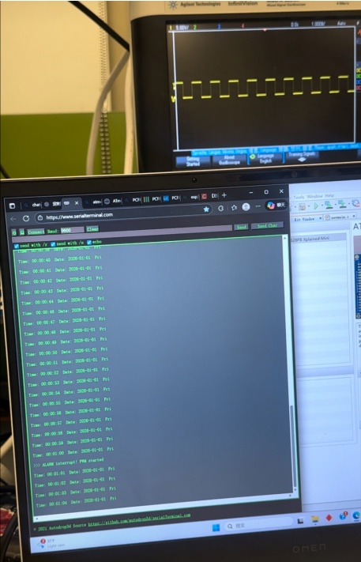
5. Have you achieved some or all of your Hardware Requirements Specification (HRS)?

   1. Show how you collected data and the outcomes.
      **HRS02:** Trying to figure out how to create an environment to test this hardware requirement.
      **HRS03:** Temperature is tested to meet the requirement by comparing with the temperature measured by a Honeywell thermostat.
      [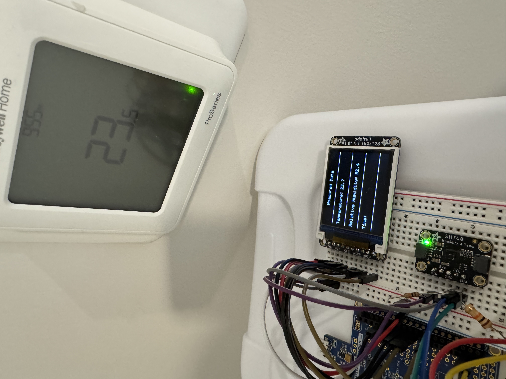](https://github.com/upenn-embedded/final-project-f25-f25-final_project-t30/blob/main/images/HRS03_temperature.jpg)
      Trying to find an accurate device to test humidity accuracy.
6. Show off the remaining elements that will make your project whole: mechanical casework, supporting graphical user interface (GUI), web portal, etc.

   1. Enable user to set the temperature and relatively humidity theorshold and show the thershold on the LCD screen.
   2. Enhance user interactivity by designing multiple watering modes to accommodate varying climatic conditions, allowing users to switch modes at their discretion.
   3. Display the current time and weather information via the UI interface design.
7. What is the riskiest part remaining of your project?

   1. How do you plan to de-risk this?
      Requires battery power supply; in damp environments, issues such as short circuits may occur, potentially leading to consequences including fire.
8. What questions or help do you need from the teaching team?

   1. How to create an environment to test HRS02?
   2. Where can I find a device which measures the relatively humidity accurately?

## Final Project Report

Don't forget to make the GitHub pages public website!
If you’ve never made a GitHub pages website before, you can follow this webpage (though, substitute your final project repository for the GitHub username one in the quickstart guide):  [https://docs.github.com/en/pages/quickstart](https://docs.github.com/en/pages/quickstart)

### 1. Video

[Insert final project video here]

* The video must demonstrate your key functionality.
* The video must be 5 minutes or less.
* Ensure your video link is accessible to the teaching team. Unlisted YouTube videos or Google Drive uploads with SEAS account access work well.
* Points will be removed if the audio quality is poor - say, if you filmed your video in a noisy electrical engineering lab.

### [Video Link](https://drive.google.com/file/d/15BnlUx_5UzXOKajAlkQ2Qy3TK4Bdy0N3/view?usp=sharing)

### 2. Images

[Insert final project images here]

*Include photos of your device from a few angles. If you have a casework, show both the exterior and interior (where the good EE bits are!).*
[.JPG)](https://github.com/upenn-embedded/final-project-f25-f25-final_project-t30/blob/main/images/image(400x400).JPG)

[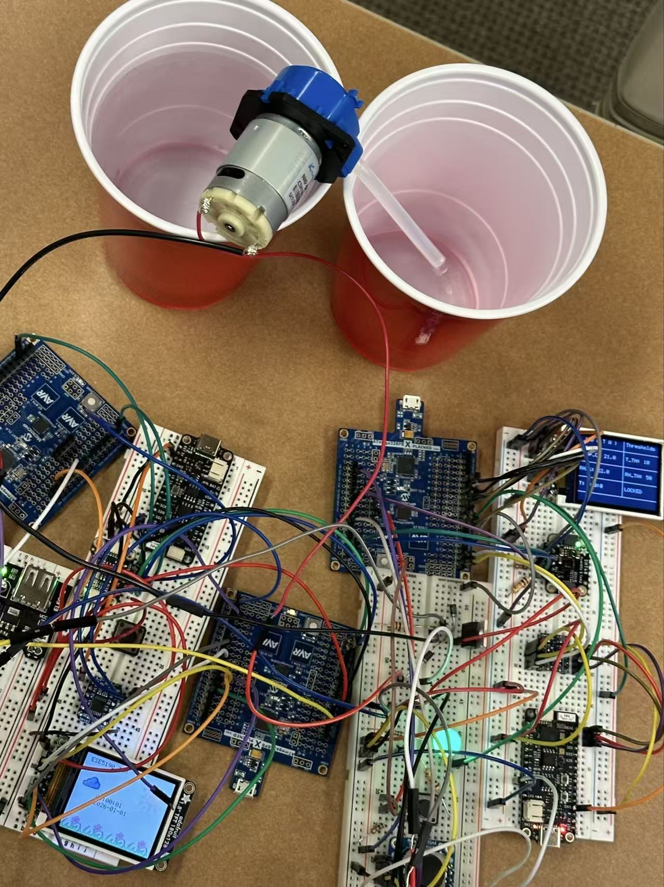](https://github.com/upenn-embedded/final-project-f25-f25-final_project-t30/blob/main/images/image2.JPG)
[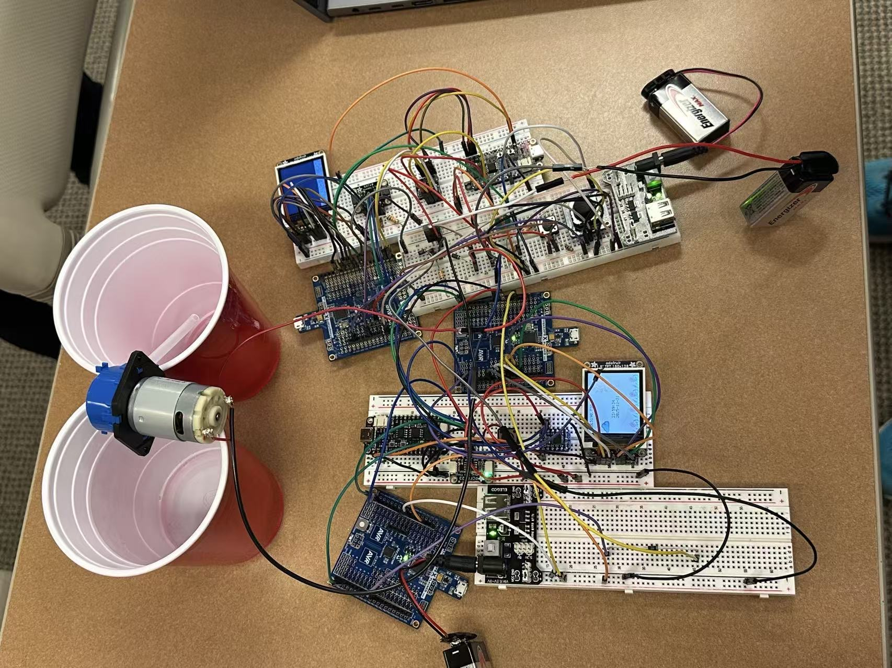](https://github.com/upenn-embedded/final-project-f25-f25-final_project-t30/blob/main/images/image3.JPG)

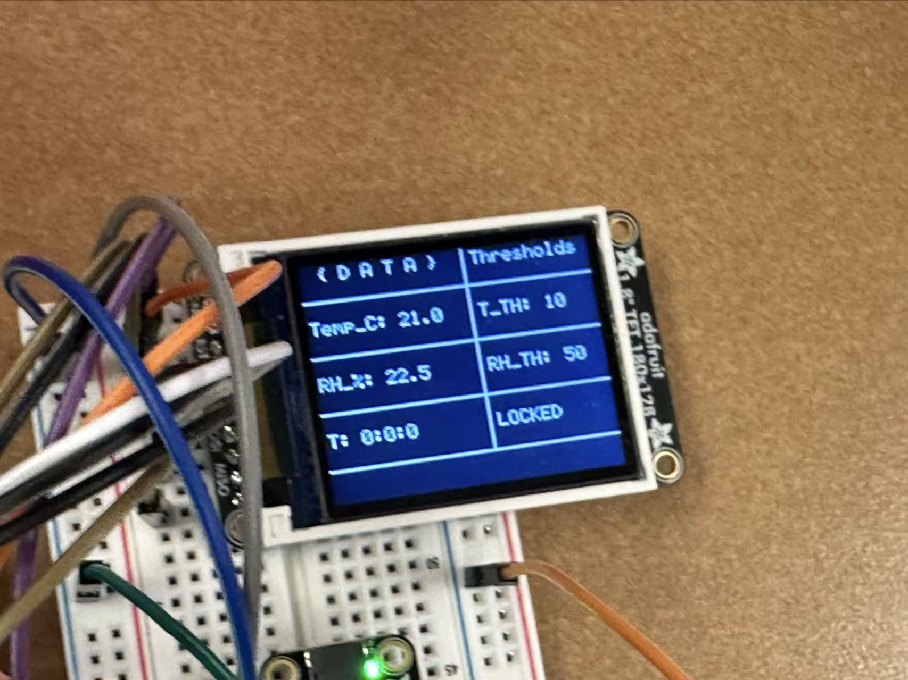

### 3. Results

*What were your results? Namely, what was the final solution/design to your problem?*

**Final block diagram:**
[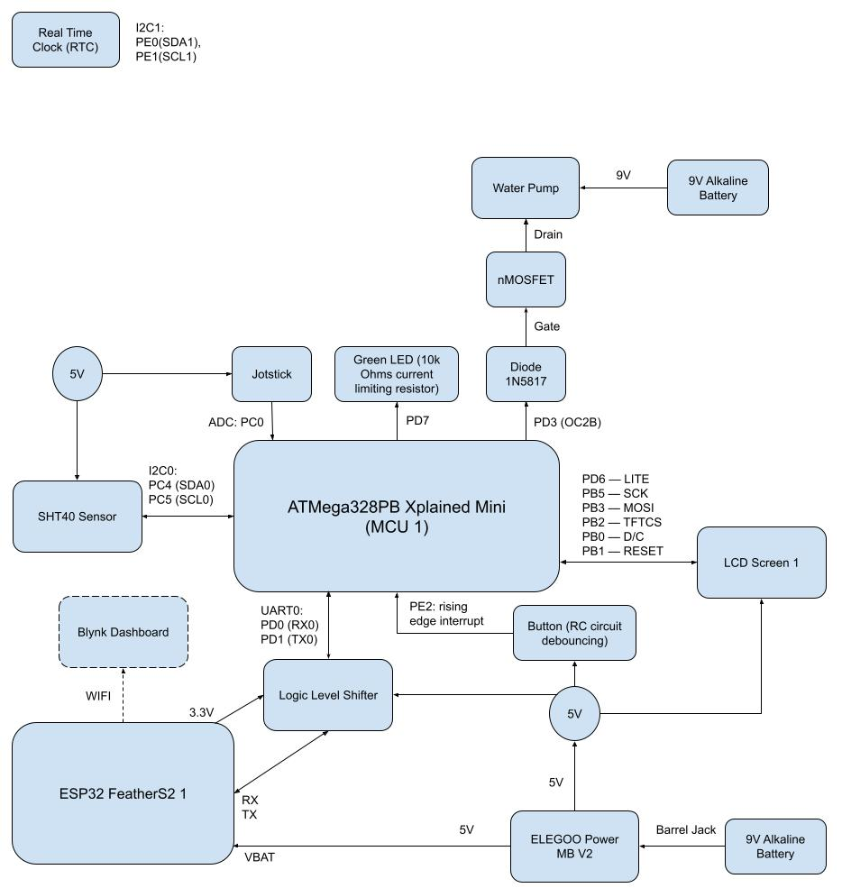](https://github.com/upenn-embedded/final-project-f25-f25-final_project-t30/blob/main/images/block_diagram_Final.jpg)

MCU2 control the RTC to trigger the water pump.

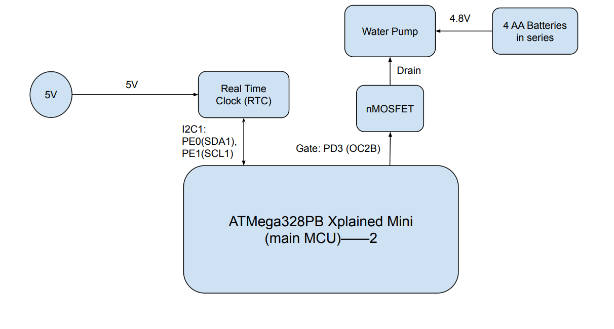

MCU2 control the screen.

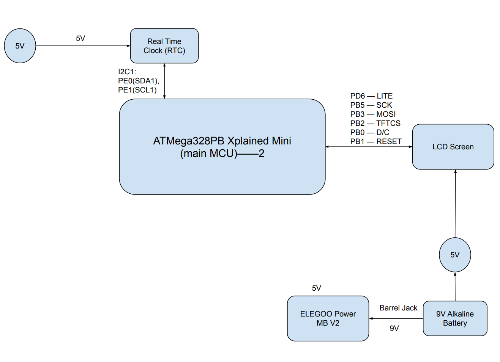

We built a drip irrigation device that irrigates plants.
If the soil is already dry, especially for arid regions, it will be too late for the device to irrigate the plant. To prevent this, the device irrigates the plant in 2 ways: 1. Regular irrigation routine: Irrigate the plant at specific moments controlled by RTC. 2. Frequent irrigation routine: Check if the temperature threshold and the relative humidity threshold are both exceeded. If yes, irrigate the plant every 30 minutes (we used 5 minutes for final demostration) that the flow rate is controlled by the water pump PWM duty cycle = 5 * (temperature - temperature threshold) + 10 * (relative humidity - relative humidity threshold).

Users may press the button to unlock the device if they want to change the 2 thresholds. When the LCD screen 1 shows "LOCKED", the user cannot change any thresholds. If the button is pressed once, the LCD screen 1 shows "T UNLOCKED", then the user may modify the temperature threshold using a joystick. If the button is pressed one more time, the LCD screen 1 shows "RH UNLOCKED", then the user may modify the relatively humidity threshold using a joystick.

Users may employ the RTC to schedule watering for plants. We have implemented a feature allowing users to set specific times, at which point a PWM signal will automatically trigger to perform a ten-second watering cycle for the plants.

Besides, the device is able to show real time, measured data, device operating time and thresholds locally on a LCD screen, and show measured data and thresholds remotely on the Blynk dashboard.

#### 3.1 Software Requirements Specification (SRS) Results

*Based on your quantified system performance, comment on how you achieved or fell short of your expected requirements.*

*Did your requirements change? If so, why? Failing to meet a requirement is acceptable; understanding the reason why is critical!*

*Validate at least two requirements, showing how you tested and your proof of work (videos, images, logic analyzer/oscilloscope captures, etc.).*

| ID     | Description                                                                                                                                                                                                                       | Validation Outcome                                                                                                                                                                                                            |
| ------ | --------------------------------------------------------------------------------------------------------------------------------------------------------------------------------------------------------------------------------- | ----------------------------------------------------------------------------------------------------------------------------------------------------------------------------------------------------------------------------- |
| SRS-01 | Watering accuracy in timed mode is within 1 second. Reference video.                                                                                                                                                              |                                                                                                                                                                                                                               |
| SRS-02 | Detect relative humidity every second. Every detection should be done within 1 second. Each detection should contain 10 measurements. If both temperature and relative humidity exceed thresholds, the water pump delivers water. | Confirmed, see the final demostraction video and the screenshot[10 Measurements](https://github.com/upenn-embedded/final-project-f25-f25-final_project-t30/blob/main/images/sprint2_i2c0_overall.png) in the GitHub repository.  |
| SRS-03 | Detect temperature every second. Every detection should be done within 1 second. Each detection should contain 10 measurements. If both temperature and relative humidity exceed thresholds, the water pump delivers water.       | Confirmed, see the final demostraction video and the screenshots[10 Measurements](https://github.com/upenn-embedded/final-project-f25-f25-final_project-t30/blob/main/images/sprint2_i2c0_overall.png) in the GitHub repository. |
| SRS-05 | The user should be able to tune temperature threshold form -20 to 80 Celsius and tune relative humidity threshold form 0 to 100 RH%                                                                                               | Confirmed, see the[mcu1_main.c](https://github.com/upenn-embedded/final-project-f25-f25-final_project-t30/blob/main/mcu1/mcu1_main.c)                                                                                            |

SRS-02 and SRS-03 are changed because: 1. Detecting temperature and relative humidity every one hour makes no sense. The device should continuously measure temperature and relative humidity to show the up to date data to the user. 2. To enable the user to change thresholds without delaying other tasks, the device must run applications in polling style. 3. More specific description of the water pump operation condition should be shown.

SRS-05 is added because this is a new function added in **Sprint2**.

#### 3.2 Hardware Requirements Specification (HRS) Results

*Based on your quantified system performance, comment on how you achieved or fell short of your expected requirements.*

*Did your requirements change? If so, why? Failing to meet a requirement is acceptable; understanding the reason why is critical!*

*Validate at least two requirements, showing how you tested and your proof of work (videos, images, logic analyzer/oscilloscope captures, etc.).*

| ID     | Description                                                                                                                                                                                                    | Validation Outcome                                                                                                                                                                                                                                                                                                             |
| ------ | -------------------------------------------------------------------------------------------------------------------------------------------------------------------------------------------------------------- | ------------------------------------------------------------------------------------------------------------------------------------------------------------------------------------------------------------------------------------------------------------------------------------------------------------------------------ |
| HRS-01 | The maximum operating power of the HRS-01 pump is 2.04W.                                                                                                                                                       |                                                                                                                                                                                                                                                                                                                                |
| HRS-02 | A relative humidity and temperature sensor shall be used for detection of relative humidity at least ranging from 30% to 80%, and temperature at least ranging from -10 Celsius degrees to 50 Celsius degrees. | Confirmed, see the[SHT40 Datasheet](https://sensirion.com/media/documents/33FD6951/6555C40E/Sensirion_Datasheet_SHT4x.pdf), as well as the [test in a high-humid environment](https://github.com/upenn-embedded/final-project-f25-f25-final_project-t30/blob/main/images/HRS03_humidity.jpg).                                        |
| HRS-03 | A relative humidity and temperature sensor shall have the accuracy tolerance of 4% RH and 1 Celsius degree.                                                                                                    | Temperature accuracy tolerance is confirmed, see picture[HRS03 temperature](https://github.com/upenn-embedded/final-project-f25-f25-final_project-t30/blob/main/images/HRS03_temperature.jpg) in the repository as well as [SHT40 Datasheet](https://sensirion.com/media/documents/33FD6951/6555C40E/Sensirion_Datasheet_SHT4x.pdf). |
| HRS-04 | RTC controls watering duration for 10 seconds.                                                                                                                                                                 |                                                                                                                                                                                                                                                                                                                                |

### 4. Conclusion

Reflect on your project. Some questions to address:

* What did you learn from it?
  1. Integrate different eletronics components together to realize desired functions.
  2. Write an I2C driver. Increase I2C speed by settings in firmware and decreasing pull-up resistors in hardware.
  3. Using UART, build communication between 2 MCUs.
  4. Use the logic analyzer to help writing I2C driver.
  5. Choose proper components that meet the goal. Make "Plan B" for the condition that key components we ordered (SHT30 and water pump) were NOT arrived as we planned.
  6. Trigger the generator using a PWM signal.
* What went well?
  1. Measure temperature and relative humidity, and show them and their thresholds on a LCD screen and on the Blynk dashboard through WIFI.
  2. Operate water pump when both the temperature and relative humidity exceed their thresholds. The water pump works at a speed decided by the difference between the temperature and its threshold plus the difference between the relative humidity and its threshold.
  3. User is able to adjust thresholds of temperature and relative humidity.
  4. Also show device operating time on the LCD screen.
* What accomplishments are you proud of?
  1. Realize all applications by bare metal programming, except the code for ESP32 FeatherS2 to receive message from ATmega328PB and to send message to the Blynk dashboard.
  2. Integrate what we have learned in Worksheets and Labs, such as PWM, interrupt, ADC, UART, I2C, button debouncing, .
  3. Write I2C driver for SHT40 sensor. Increase the actual I2C speed by decreasing the pull-up resistance.
  4. "Plan B" for unexpected conditions works well.
* What did you learn/gain from this experience?
  1. The process of building a project in real life.
  2. Time management. Make backup plan.
  3. Logic analyzer is extremely helpful in testing and debugging I2C, UART and PWM.
* Did you have to change your approach?
  1. Change SHT30 sensor to SHT40 sensor because it is said to be arrived but I cannot find it.
  2. Change the water pump we ordered to a water pump in Detkin Lab since the water pump we ordered did NOT arrive.
  3. Add function that enable user to modify thresholds to increase the device's practicallity and flexibility.
* What could have been done differently?
  1. Integrate all applications in one ATmega328PB Xplained Mini board.
  2. Build a shell by 3D printing.
* Did you encounter obstacles that you didn’t anticipate?
  1. Construct the project proposal.
  2. 2 out of 3 components we ordered were NOT avaliable: SHT30 sensor and the water pump.
  3. Time management and collabration.
* What could be a next step for this project?
  1. Integrate RTC application with the system in firmware level. Build a shell by 3D printing.

## References

Fill in your references here as you work on your final project. Describe any libraries used here.

1. [ESP32 UART API](https://docs.espressif.com/projects/arduino-esp32/en/latest/api/serial.html)
2. [Send Data to Blynk](https://docs.blynk.io/en/getting-started/how-to-display-any-sensor-data-in-blynk-app)
